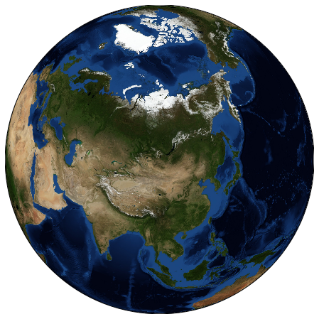
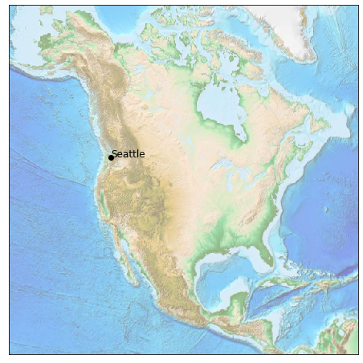
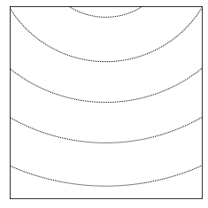
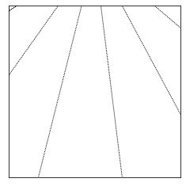
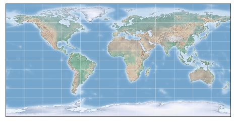
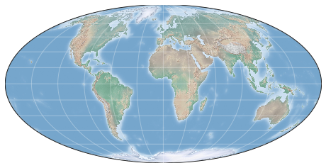
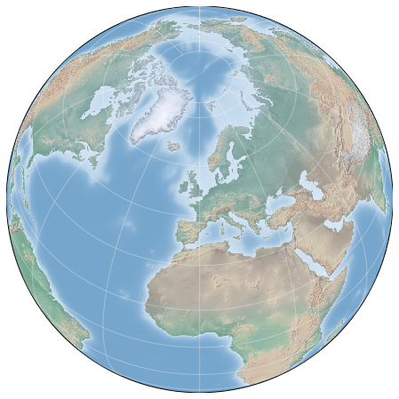
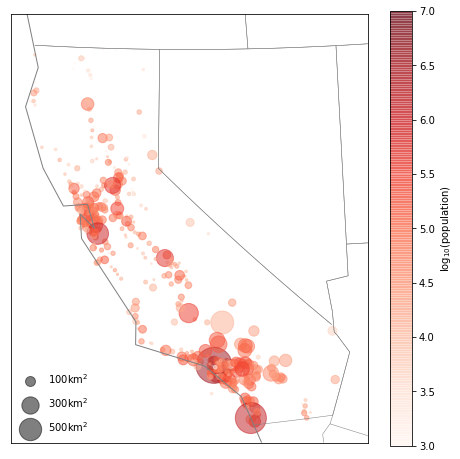

## 4.15 用Basemap可视化地理数据


```python
import numpy as np
import matplotlib.pyplot as plt
from mpl_toolkits.basemap import Basemap
```

### 初体验


```python
#地球的“蓝色弹珠”投影照片
plt.figure(figsize=(8,8))
m=Basemap(projection='ortho',resolution=None,lat_0=50,lon_0=100)
m.bluemarble(scale=0.5)
```

    Clipping input data to the valid range for imshow with RGB data ([0..1] for floats or [0..255] for integers).
    


    <matplotlib.image.AxesImage at 0x20d8ae56a08>





这里显示的地球并不是一个静止的图形。它是一个用球面坐标系构建的、功能齐全的matplotlib坐标轴，可以很轻易地在地图上增添数据。

举例：将地图投影放大到北美洲，然后标出西雅图的位置。用ETOPO地图（etopo image，显示陆地与海底的地形特征）作为背景


```python
fig=plt.figure(figsize=(8,8))
m=Basemap(projection='lcc',resolution=None,
         width=8E6,height=8E6,
         lat_0=45,lon_0=-100,)
m.etopo(scale=0.5,alpha=0.5)

#地图上的（经度，维度)对应图上的（x,y）坐标
x,y=m(-122.3,47.6)
plt.plot(x,y,'ok')
plt.text(x,y,'Seattle',fontsize=12);
```

    Clipping input data to the valid range for imshow with RGB data ([0..1] for floats or [0..255] for integers).
    





### 4.15.1 地图投影

当你想使用地图时，首先要做的就是确定地图的投影类型。Basemap程序包里实现了几十种投影类型，所有投影都有一个简单格式码。下面进行简单的演示。

首先定义一个可以画带经纬线地图的简便方法：


```python
from itertools import chain
```


```python
def draw_map(m,scale=0.2):
    #画地貌晕渲图
    m.shadedrelief(scale=scale)
    
    #用字典表示经纬度
    lats=m.drawparallels(np.linspace(-90,90,13))
    lons=m.drawmeridians(np.linspace(-180,180,13))
    
    #字典的键是plt.Line2D示例
    lat_lines=chain(*(tup[1][0] for tup in lats.items()))
    lon_lines=chain(*(tup[1][0] for tup in lons.items()))
    all_lines=chain(lat_lines,lon_lines)
    
    #用循环将所有线设置成需要的样式
    for line in all_lines:
        line.set(linestyle='-',alpha=0.3,color='w')
```


```python
lats=m.drawparallels(np.linspace(-90,90,13))
```





```python
lons=m.drawmeridians(np.linspace(-180,180,13))
```





```python
lon_lines=chain(*(tup[1][0] for tup in lons.items()))
all_lines=chain(lat_lines,lon_lines)
all_lines
```


    <itertools.chain at 0x20d8a6c8e88>


#### 1、圆柱投影(cyl)

* 最简单的地图投影类型，纬度线与经度线分别映射成水平线与竖直线。
* 优点：赤道区域的显示效果非常好。
* 缺点：南北极附件的区域严重变形。


```python
fig=plt.figure(figsize=(8,6),edgecolor='w')
m=Basemap(projection='cyl',resolution=None
         ,llcrnrlat=-90,urcrnrlat=90
         ,llcrnrlon=-180,urcrnrlon=180,)
draw_map(m)
#Basemapd的参数：左下角（llcrnr）,右上角（urcrnr）,纬度（lat），经度（lon）
```





#### 2、伪圆柱投影(moll)

* 经线是椭圆弧线，保留了地图原貌。
* 虽然南北极附近的区域还有一些变形，但是通过一些区域小图可以反映真实情况。


```python
fig=plt.figure(figsize=(8,6),edgecolor='w')
m=Basemap(projection='moll',resolution=None,
         lat_0=0,lon_0=0)
draw_map(m)
#Basemapd的另外两个额外参数，用来表示地图中心的维度（lat_0）和经度（lon_0）
```





#### 3、透视投影

*从某一个透视点对地球进行透视获得的投影
* 实例：正射（‘ortho’）即从无限远处观察地球的一侧，一次只能显示半个地球；球心投影（‘gnom’）、球极平面（‘stere’）
* 常用于显示地图的较小面积区域


```python
fig=plt.figure(figsize=(8,8))
m=Basemap(projection='ortho',resolution=None,lat_0=50,lon_0=0)
draw_map(m)
```





#### 4、圆锥投影


* 即先将地图投影成一个圆锥体，然后再将其展开。
* 可以获得非常好的局部效果，但是远离圆锥顶点的区域可能会严重变形。
* 举例：兰勃特等角圆锥投影（‘lcc’）：将地图投影成一个由两条标准纬线（用Basemap里的lat_1与lat_2参数设置）构成的圆锥，这两条纬线距离是经过精心挑选的额，在两条标准纬线之内比例尺逐渐减小，在两线之外的比例尺逐渐增大。
* 其他例子：等距圆锥（‘eqdc’）、阿尔伯斯等积圆锥（‘aea’）
* 适合显示较小与中等区域的地图。

#### 5、其他投影类型

### 4.15.2 画一个地图背景

* bluemarble()和shadedrelief()：画地球投影
* drawparallels()和drawmeridians():画纬线和经线
* 可以借助IPython的帮助功能查看他们的具体用法

### 4.15.3 在地图上画数据

### 4.15.4 案例：美国加州城市数据


```python
import pandas as pd 
df=pd.read_csv('F:/some_now/PythonDataScienceHandbook-master/PythonDataScienceHandbook-master/notebooks/data/california_cities.csv')
```


```python
df.info()
```

    <class 'pandas.core.frame.DataFrame'>
    RangeIndex: 482 entries, 0 to 481
    Data columns (total 14 columns):
     #   Column              Non-Null Count  Dtype  
    ---  ------              --------------  -----  
     0   Unnamed: 0          482 non-null    int64  
     1   city                482 non-null    object 
     2   latd                482 non-null    float64
     3   longd               482 non-null    float64
     4   elevation_m         434 non-null    float64
     5   elevation_ft        470 non-null    float64
     6   population_total    482 non-null    int64  
     7   area_total_sq_mi    480 non-null    float64
     8   area_land_sq_mi     482 non-null    float64
     9   area_water_sq_mi    481 non-null    float64
     10  area_total_km2      477 non-null    float64
     11  area_land_km2       478 non-null    float64
     12  area_water_km2      478 non-null    float64
     13  area_water_percent  477 non-null    float64
    dtypes: float64(11), int64(2), object(1)
    memory usage: 52.8+ KB
    


```python
df.head().append(df.tail())
```


<div>
<style scoped>
    .dataframe tbody tr th:only-of-type {
        vertical-align: middle;
    }

    .dataframe tbody tr th {
        vertical-align: top;
    }

    .dataframe thead th {
        text-align: right;
    }
</style>
<table border="1" class="dataframe">
  <thead>
    <tr style="text-align: right;">
      <th></th>
      <th>Unnamed: 0</th>
      <th>city</th>
      <th>latd</th>
      <th>longd</th>
      <th>elevation_m</th>
      <th>elevation_ft</th>
      <th>population_total</th>
      <th>area_total_sq_mi</th>
      <th>area_land_sq_mi</th>
      <th>area_water_sq_mi</th>
      <th>area_total_km2</th>
      <th>area_land_km2</th>
      <th>area_water_km2</th>
      <th>area_water_percent</th>
    </tr>
  </thead>
  <tbody>
    <tr>
      <th>0</th>
      <td>0</td>
      <td>Adelanto</td>
      <td>34.576111</td>
      <td>-117.432778</td>
      <td>875.0</td>
      <td>2871.0</td>
      <td>31765</td>
      <td>56.027</td>
      <td>56.009</td>
      <td>0.018</td>
      <td>145.107</td>
      <td>145.062</td>
      <td>0.046</td>
      <td>0.03</td>
    </tr>
    <tr>
      <th>1</th>
      <td>1</td>
      <td>AgouraHills</td>
      <td>34.153333</td>
      <td>-118.761667</td>
      <td>281.0</td>
      <td>922.0</td>
      <td>20330</td>
      <td>7.822</td>
      <td>7.793</td>
      <td>0.029</td>
      <td>20.260</td>
      <td>20.184</td>
      <td>0.076</td>
      <td>0.37</td>
    </tr>
    <tr>
      <th>2</th>
      <td>2</td>
      <td>Alameda</td>
      <td>37.756111</td>
      <td>-122.274444</td>
      <td>NaN</td>
      <td>33.0</td>
      <td>75467</td>
      <td>22.960</td>
      <td>10.611</td>
      <td>12.349</td>
      <td>59.465</td>
      <td>27.482</td>
      <td>31.983</td>
      <td>53.79</td>
    </tr>
    <tr>
      <th>3</th>
      <td>3</td>
      <td>Albany</td>
      <td>37.886944</td>
      <td>-122.297778</td>
      <td>NaN</td>
      <td>43.0</td>
      <td>18969</td>
      <td>5.465</td>
      <td>1.788</td>
      <td>3.677</td>
      <td>14.155</td>
      <td>4.632</td>
      <td>9.524</td>
      <td>67.28</td>
    </tr>
    <tr>
      <th>4</th>
      <td>4</td>
      <td>Alhambra</td>
      <td>34.081944</td>
      <td>-118.135000</td>
      <td>150.0</td>
      <td>492.0</td>
      <td>83089</td>
      <td>7.632</td>
      <td>7.631</td>
      <td>0.001</td>
      <td>19.766</td>
      <td>19.763</td>
      <td>0.003</td>
      <td>0.01</td>
    </tr>
    <tr>
      <th>477</th>
      <td>477</td>
      <td>Yountville</td>
      <td>38.403056</td>
      <td>-122.362222</td>
      <td>30.0</td>
      <td>98.0</td>
      <td>2933</td>
      <td>1.531</td>
      <td>1.531</td>
      <td>0.000</td>
      <td>3.966</td>
      <td>3.966</td>
      <td>0.000</td>
      <td>0.00</td>
    </tr>
    <tr>
      <th>478</th>
      <td>478</td>
      <td>Yreka</td>
      <td>41.726667</td>
      <td>-122.637500</td>
      <td>787.0</td>
      <td>2582.0</td>
      <td>7765</td>
      <td>10.053</td>
      <td>9.980</td>
      <td>0.073</td>
      <td>26.036</td>
      <td>25.847</td>
      <td>0.188</td>
      <td>0.72</td>
    </tr>
    <tr>
      <th>479</th>
      <td>479</td>
      <td>YubaCity</td>
      <td>39.134722</td>
      <td>-121.626111</td>
      <td>18.0</td>
      <td>59.0</td>
      <td>64925</td>
      <td>14.656</td>
      <td>14.578</td>
      <td>0.078</td>
      <td>37.959</td>
      <td>37.758</td>
      <td>0.201</td>
      <td>0.53</td>
    </tr>
    <tr>
      <th>480</th>
      <td>480</td>
      <td>Yucaipa</td>
      <td>34.030278</td>
      <td>-117.048611</td>
      <td>798.0</td>
      <td>2618.0</td>
      <td>51367</td>
      <td>27.893</td>
      <td>27.888</td>
      <td>0.005</td>
      <td>72.244</td>
      <td>72.231</td>
      <td>0.013</td>
      <td>0.02</td>
    </tr>
    <tr>
      <th>481</th>
      <td>481</td>
      <td>YuccaValley</td>
      <td>34.133333</td>
      <td>-116.416667</td>
      <td>1027.0</td>
      <td>3369.0</td>
      <td>20700</td>
      <td>40.015</td>
      <td>40.015</td>
      <td>0.000</td>
      <td>103.639</td>
      <td>103.639</td>
      <td>0.000</td>
      <td>0.00</td>
    </tr>
  </tbody>
</table>
</div>


```python
#提取需要的数据
lat=df['latd'].values
lon=df['longd'].values
population=df['population_total'].values
area=df['area_total_km2'].values
```


```python
#1、绘制地图背景
fig=plt.figure(figsize=(8,8))
m=Basemap(projection='lcc',resolution='c'
         ,lat_0=37.5,lon_0=-119
         ,width=1E6,height=1.2E6)
#地貌晕渲图
#m.shadedrelief()
#绘制大陆海岸线
m.drawcoastlines(color='gray')
#绘制国界线
m.drawcountries(color='gray')
#绘制美国州界线
m.drawstates(color='gray')


#2、绘制城市数据散点，用颜色表示人口数据，并且点的大小表示面积
m.scatter(lon,lat,latlon=True
         ,c=np.log10(population),s=area
         ,cmap='Reds',alpha=0.5)

#3、创建颜色条与图例
plt.colorbar(label=r'$\log_{10}({\rm population})$')
plt.clim(3,7)

#用虚拟点绘制图例
for a in [100,300,500]:
    plt.scatter([],[],c='k',alpha=0.5,s=a
               ,label=str(a)+'km$^2$')
    plt.legend(scatterpoints=1,frameon=False
               ,labelspacing=1,loc='lower left');

```

    E:\downloads\code_app\anaconda\lib\site-packages\ipykernel_launcher.py:5: MatplotlibDeprecationWarning: 
    The dedent function was deprecated in Matplotlib 3.1 and will be removed in 3.3. Use inspect.cleandoc instead.
      """
    E:\downloads\code_app\anaconda\lib\site-packages\ipykernel_launcher.py:11: MatplotlibDeprecationWarning: 
    The dedent function was deprecated in Matplotlib 3.1 and will be removed in 3.3. Use inspect.cleandoc instead.
      # This is added back by InteractiveShellApp.init_path()
    E:\downloads\code_app\anaconda\lib\site-packages\ipykernel_launcher.py:13: MatplotlibDeprecationWarning: 
    The dedent function was deprecated in Matplotlib 3.1 and will be removed in 3.3. Use inspect.cleandoc instead.
      del sys.path[0]
    




